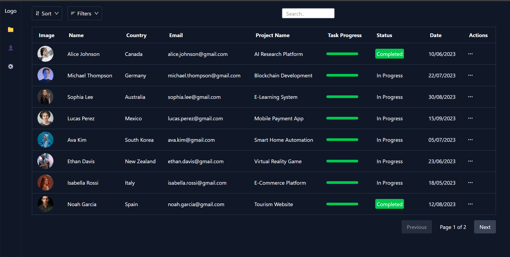

# 📊 React + TypeScript Data Table with Sorting, Filtering, Search & Pagination

A **pure frontend React + TypeScript** project that displays tabular data with sorting, filtering, searching, pagination, and inline status updates.  
All data is stored locally in a `data.ts` file — no backend required.

---

## ✨ Features

- 🔍 **Search**: Instantly search across all columns
- 📂 **Filtering**:
  - Filter by **Name**
  - Filter by **Country**
  - Filter by **Email**
  - Filter by **Project Name**
  - Filter by **Status** (Completed, In Progress)
- 📑 **Sorting**:
  - Sort by **Name** (A–Z / Z–A)
  - Sort by **Country**
  - Sort by **Date**
- 📅 **Pagination**:
  - Basic previous/next navigation
  - Shows current page indicator
- ⚡ **Inline Status Update**:
  - Update the **Task Status** directly from the Actions column
- 🛡 **TypeScript** for safer, type-checked code

---

## 🛠 Tech Stack

- **React** (Functional Components)
- **TypeScript**
- **React Hooks**
- **Tailwind CSS**
- **Local Data Source** (`data.ts` file)

---

## 🧠 How It Works
- Data Source: All data is stored in src/data.ts as a TypeScript array of objects
- Sorting: Clicking on column headers toggles ascending/descending sort order
- Filtering: Dropdown menus let you filter rows by multiple criteria
- Search: The search bar filters rows in real time
- Pagination: Displays limited rows per page with navigation buttons
- Status Update: Clicking the action button allows you to change the status field

---

## 📌 Notes
- This is frontend only — no API or database is connected
- Changes to the table (like status updates) are not persisted after refresh
- For persistence, you can integrate with localStorage or a backend API
